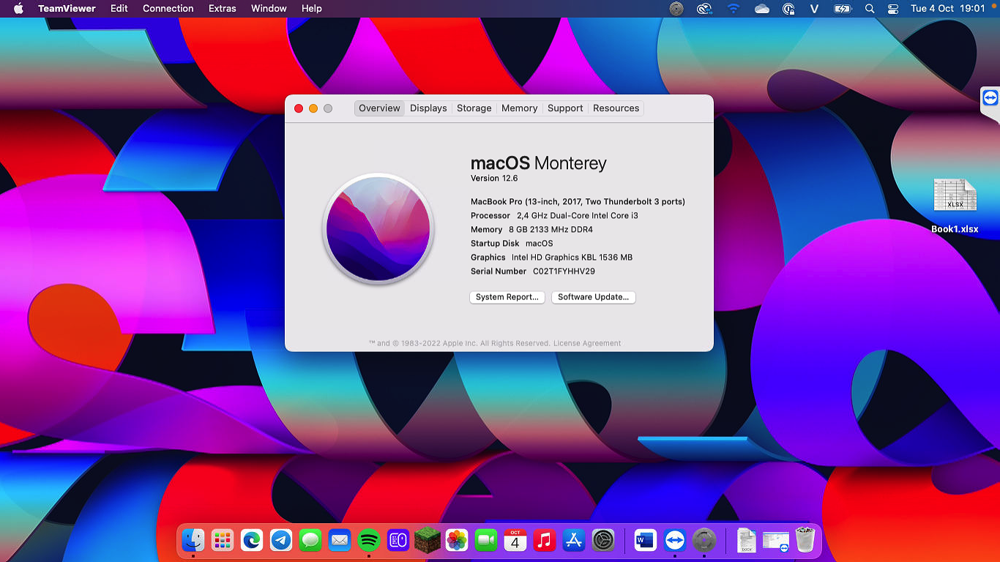

# 
Dell Vostro 3468 Hackintosh
 

## Intro

| | Version |
|-|---------|
| OpenCore | 0.8.5 |
| macOS | Monterey 12.6 |

## Laptop Specification

|                     | Specifications| Note |
| ---------------------------- | ---------------------- |------------------|
| ``Chipset``| Intel Sunrise Point |   |
| ``CPU``| Intel Core i3-7100U 2.40GHz |  |
| ``Memory``| 8GB DDR4-2133MHz |  |
| ``iGPU``| Intel HD Graphics 620 | With full QE/CI (Graphics accleration) |
| ``Disk``| WDC WDS480G2G0A-00JH30 |  |
| ``Screen``| 14.0" 1366 x 768 |    |
| ``Ethernet``| RTL8111/8168/8411 PCI Express Gigabit Ethernet Controller | Use [RealtekRTL8111](https://github.com/Mieze/RTL8111_driver_for_OS_X/releases). |
| ``WiFi and Bluetooth``| Qualcomn Atheros QCA9377 | Not Working (Use TL-WN725Nv3 Wifi USB) | 
| ``Audio``| ALC256 | Add `alcid=21` to boot-arg or add layout-id to DeviceProperties. |
| ``Keyboard``| - |  |
| ``Touchpad``| Dell Touchpad (Synapstic, PS/2) |  |
| ``Battery``| 40Wh 4-cell lithium ion | |
| ``Dimensions``| 23.35mm x 345mm x 243mm |     |
| ``Weight``| 1.76kg |     |

## Features

| ``Features``|``Working``| 
|-------------|-----------|
| ``Wifi``|✅|
| ``Bluetooth``|❌|
| ``Audio``|✅|
| ``Keyboard and Trackpad``|✅|
| ``Headphone Jack``|✅|
| ``Graphics``|✅|
| ``Battery``|✅|
| ``Power Management``|✅|
| ``Multigesture Trackpad``|✅|                                                                          
| ``Webcam``|✅|
| ``USB Port``|✅|
| ``Facetime and iMessage``|✅|
| ``Ethernet``|✅|
| ``Hotkeys``|✅|
| ``Sleep``|❌|
